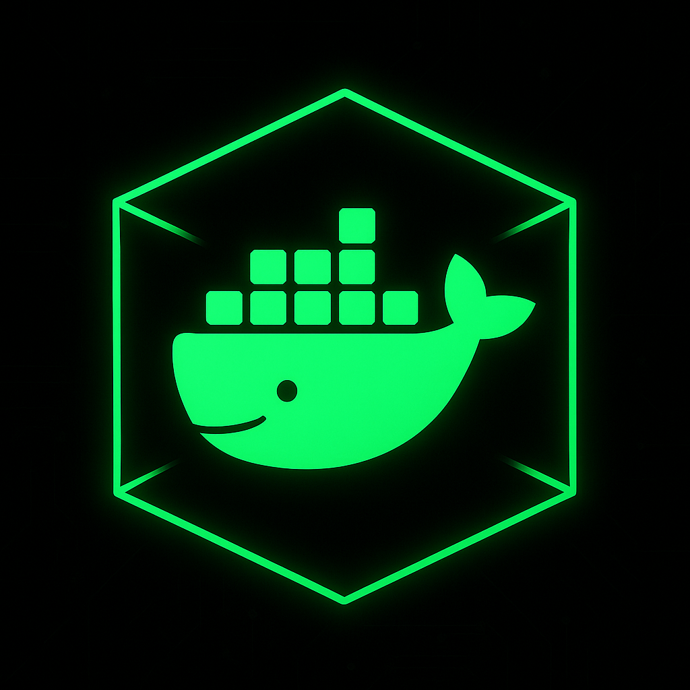

<p align="center">
 

# Security International Group - Hardened Docker Image

A security-hardened Debian-based Docker image that can host applications while maintaining CIS compliance and security best practices.

 ## Docker Hub

[](https://hub.docker.com/r/tburns0321/hardn-docker)
[](https://github.com/Security-International-Group/HARDN_DOCKER/actions/workflows/trivy.yml)
[](https://www.debian.org/)
[](https://hits.sh/github.com/Security-International-Group/HARDN_DOCKER/)

**Pull from Docker Hub:**
```bash
docker pull tburns0321/hardn-docker:1.0.21
```
## Quick Start

### 1. Clone and Build
```bash
git clone https://github.com/Security-International-Group/HARDN_DOCKER.git
cd HARDN_DOCKER
docker-compose build
```

### 2. Run the Container and test
```bash
docker compose build --no-cache
docker compose up -d
curl http://localhost:8082
```

### 3. Troubleshooting
- Here are the troubleshooting commands to navigate any build or run errors.
```bash
docker compose logs --tail 100
docker compose exec hardn /usr/local/bin/deb.hardn.sh --remediate-all
```

## Security Features

### CIS Docker Benchmark Compliance
- **Automated Security Hardening**: CIS Docker 1.13.0 compliant configuration
- **Docker Bench Security Integration**: Built-in security auditing and remediation
- **Host-Level Security**: Scripts for Docker daemon and host security configuration

### Key Security Measures
-  **Non-root execution** (runs as uid=10001)
-  **AppArmor profiles** for container security
-  **Seccomp profiles** for syscall restrictions
-  **Memory and resource limits** enforced
-  **Read-only root filesystem** with tmpfs mounts
-  **TLS encryption** for Docker daemon
-  **Audit logging** for Docker events
-  **No new privileges** capability
-  **User namespace remapping** enabled

### Hardening Scripts
The image includes comprehensive hardening scripts in `/sources/`:
- `compliance/` - OpenSCAP and cron-based compliance monitoring
- `memory/` - Memory protection and partition management (`part.sh`)
- `network/` - Network security and intrusion detection
- `privilege/` - PAM security and privilege escalation prevention
- `security/` - Core security configurations and integrity monitoring

## Security Model

### Build-Time Hardening
- All security scripts execute during Docker build as root
- System configurations are applied and locked down
- Hardening completion marker is created
- Image is prepared for secure runtime execution

### Runtime Security
- Container runs as non-root user (uid=10001)
- Hardening scripts are skipped (already completed)
- Application executes with minimal privileges
- Security policies remain enforced

## Application Deployment

The container includes a sample web application served via `socat` that demonstrates the image can successfully host applications. To deploy your own application:

1. Replace `/usr/local/bin/simple-server` with your application
2. Update the Dockerfile CMD if needed
3. Rebuild the image

The container runs as a non-root user with comprehensive security hardening while maintaining full application functionality.

---

*Built with security and compliance in mind for production deployments.*
## Vulnerability Scanning with Trivy

Validate the hardened image using Trivy after each build.

```
Report Summary

┌────────────────────────────────┬────────┬─────────────────┐
│             Target             │  Type  │ Vulnerabilities │
├────────────────────────────────┼────────┼─────────────────┤
│ hardn-xdr:latest (debian 13.2) │ debian │        0        │
└────────────────────────────────┴────────┴─────────────────┘
Legend:
- '-': Not scanned
- '0': Clean (no security findings detected)
```

### Scan 

```bash
# If you have the docker CLI plugin:
docker compose build --no-cache
trivy image hardn-xdr:latest --severity HIGH,CRITICAL --scanners vuln
trivy image hardn-xdr:latest --scanners vuln
```

## Architecture

```bash
hardn-xdr/
├─ Dockerfile                   
├─ docker-compose.yml           
├─ deb.hardn.sh                
├─ entrypoint.sh               
├─ health_check.sh              
├─ smoke_test.sh                
├─ src/sources/                 
│  ├─ compliance/
│  │  ├─ openscap-registry.sh   # OpenSCAP compliance scanning
│  │  └─ cron.sh               # Automated compliance monitoring
│  ├─ memory/
│  │  ├─ clamav.sh            # ClamAV antivirus configuration
│  │  ├─ part.sh              # Docker partition & memory security
│  │  └─ protection.sh        # Memory protection & buffer overflow prevention
│  ├─ network/
│  │  └─ tripwire.sh          # Tripwire intrusion detection (AIDE removed to reduce dependencies/CVEs)
│  ├─ privilege/
│  │  ├─ access.sh            # PAM security & user access controls
│  │  └─ rkhunter.sh          # rkhunter rootkit detection
│  └─ security/
│     ├─ apparmor.sh          # AppArmor profile configuration
│     ├─ docker-daemon.sh     # Docker daemon security setup
│     ├─ host-config.sh       # Host security configuration
│     ├─ image-security.sh    # Container image security
│     ├─ integrity.sh         # File integrity monitoring
│     ├─ security.sh          # Core security configurations
│     └─ docker-daemon.sh     # Docker daemon security (TLS, audit, etc.)
├─ README.md                    # This documentation
└─ SECURITY-REMEDIATION.md     # Security hardening guide
```
