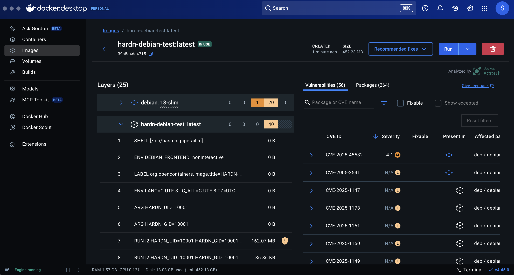

<p align="center">
  
  <br>
  <a href="https://github.com/OpenSource-For-Freedom/hardn_debian_docker_image/actions/workflows/docker-publish.yml">
    
  </a>
  <a href="https://github.com/OpenSource-For-Freedom/hardn_debian_docker_image/actions/workflows/trivy.yml">
    
  </a>
</p>

<div align="center">
  <h1>HARDN_Debian_Docker_image</h1>

  
</div>

## Overview
- **Base OS:** Debian 13 “Trixie,” latest stable release.
- **Security Hardened:** Automated removal of OS and container CVEs during build and runtime using `deb.hardn.sh`.
- **Compliance Goals:** Built to exceed industry standards (HARDN, STIG, CIS).
- **Zero CVE Builds:** Containers are continuously monitored and updated to ensure no known vulnerabilities using `.github/workflows/trixie.yml`.
- **Read-Only & tmpfs Support:** Example run commands demonstrate best practices for least privilege and ephemeral storage.
- **Automated CI/CD:** Integrated with GitHub Actions for build validation and vulnerability scanning (Trivy).

### Deployments
- Deploy as a secure base image for microservices and critical workloads.
- Ideal for regulated environments demanding high compliance and security assurance.
- Continuous integration in DevSecOps pipelines.

## Packages
- Current GHCR-OCI [Package](https://github.com/OpenSource-For-Freedom/hardn_debian_docker_image/pkgs/container/hardn_debian_docker_image)

## Architecture 

```bash
hardn-xdr-deb/
├─ Dockerfile
├─ deb.hardn.sh
├─ entrypoint.sh
├─ smoke_test.sh
├─ README.md
├─ .github/
│  └─ workflows/
│     └─ build-and-publish.yml
```

### Release
Here you can find the latest GHCR Release.
- [Releases](https://github.com/OpenSource-For-Freedom/hardn_debian_docker_image/releases)
  
## Build
```bash
# Remove any previous container 
docker rm -f hardn-xdr 2>/dev/null || true
# Build 
docker build -t hardn-xdr:deb13 .
# Run 
docker run --name hardn-xdr -d hardn-xdr:deb13

# read only + tmpfs
docker rm -f hardn-xdr 2>/dev/null || true
docker run --name hardn-xdr -d \
  --read-only \
  --tmpfs /tmp:rw,noexec,nosuid,mode=1777,size=64m \
  --tmpfs /run:rw,noexec,nosuid,mode=0755,size=16m \
  --tmpfs /home/hardn:rw,mode=0755,size=32m \
  --tmpfs /opt/hardn-xdr:rw,mode=0755,size=64m \
  hardn-xdr:deb13

# Pull and run published image from GHCR

docker pull ghcr.io/openSource-for-freedom/hardn_debian_docker_image:deb13
docker run --name hardn-xdr -d ghcr.io/openSource-for-freedom/hardn_debian_docker_image:deb13

```

## Testing 

- Currently "0" CVE builds - OS and Container.
- deb.hardn.sh deploys a slim security slice into the Container which fully removes all local Debian 13, and Docker Image CVE's during build and run. 
- CVE-2025-45582 — Medium Severity (CVSS 3.1: 4.1) does not pertain to this package. Tar is not a utilized dependacy but does exist in Debian 13 base image pre-build.
- Activily testing increased CIS Compliance as well as docker Bench Testing by [Docker](https://github.com/docker/docker-bench-security)
- currently there are only minimal CIS 1.13 benchmarks for Debian Trixie.
- The file `smoke_test.sh` deploys a high level compliance check pre-depolymnet to GHCR/Ci. 
```
echo "=========================================="
echo " HARDN-XDR Container Health Check"
echo " CIS Docker Benchmark 1.13.0 Compliance"
echo "=========================================="

# CIS 4.1: Ensure a user for the container has been created...
```


## Security
- Reporting a Vulnerability or compliance > [Security Policy](https://github.com/OpenSource-For-Freedom/hardn_debian_docker_image/security/policy)

## DevOPs Testing and Workspace
- Github https://github.com/Security-International-Group
