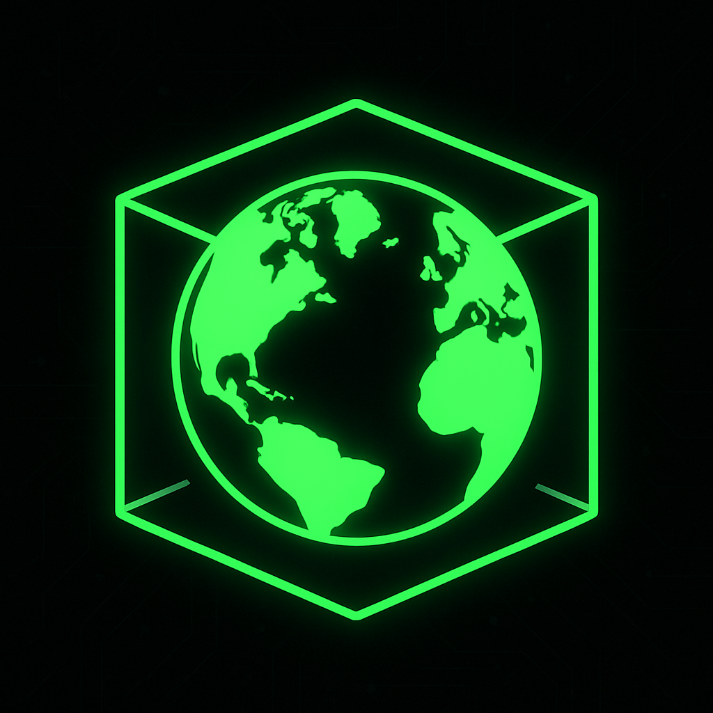

# HARDN_Debian_Docker_image

- A Deployable Debian 13: trixie , HARDN/STIG/CIS compliant Dockerfile image
---
## Packaging Status
- [](https://github.com/OpenSource-For-Freedom/hardn_debian_docker_image/actions/workflows/docker-publish.yml)
## Build
```bash
# Build 
docker build -t hardn-xdr:deb12 .

# Remove any previous container 
docker rm -f hardn-xdr 2>/dev/null || true

# Run 
docker run --name hardn-xdr -d hardn-xdr:deb12
```
---
## Architecture 

```bash
.
├── .github/
│   └── workflows/
├── src/
│   └── sources/
│       ├── compliance/
│       ├── memory/
│       ├── network/
│       ├── privilege/
│       └── security/
├── .dockerignore
├── Dockerfile
├── LICENSE
├── README.md
├── deb.hardn.sh
├── docker-compose.yml
├── entrypoint.sh
└── smoke_test.sh
```

## Status / Goals

- Curent docker package build "under Construction" 
- Current Docker image: Deployable
- Currnet Debian 13: slim OS: Deployable
