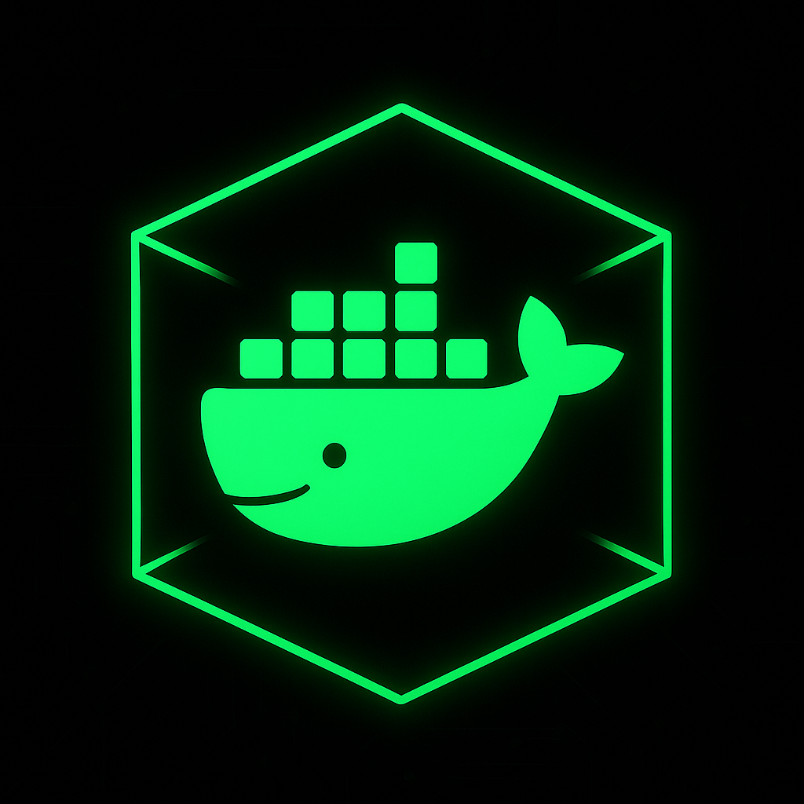

<p align="center">

<p align="center">
	<strong>Security International Group - Hardened Docker Image</strong><br>
	A security-hardened Debian 13 (Trixie) Docker image with pure container-internal CIS/STIG hardening — no host changes, no daemon writes, no socket access.
</p>

<p align="center">
	<a href="https://hub.docker.com/r/tburns0321/hardn-docker"></a>
	<a href="https://github.com/Security-International-Group/HARDN_DOCKER/actions/workflows/trivy.yml"></a>
	<a href="https://www.debian.org/"></a>
	<a href="https://hits.sh/github.com/Security-International-Group/HARDN_DOCKER/"></a>
</p>

---

## Quick Start

### 1. Clone and build

```bash
git clone https://github.com/Security-International-Group/HARDN_DOCKER.git
cd HARDN_DOCKER
docker compose build --no-cache
```

### 2. Run

```bash
docker compose up -d
docker compose ps          # confirm hardn_docker is Up (healthy)
docker compose logs -f     # watch build-time hardening output
```

### 3. Stop

```bash
docker compose down
```

---

## Web Dashboard

The container runs a Flask compliance dashboard on port **5000** inside the container, mapped to **`http://localhost:8082`** on the host (see `docker-compose.yml`).

### Endpoints

| URL | Description |
|-----|-------------|
| `http://localhost:8082/` | HTML compliance report — shows CIS check results with the HARDN-XDR branding |
| `http://localhost:8082/health` | JSON health probe — `{"status": "healthy"}` |
| `http://localhost:8082/compliance` | JSON CIS benchmark results |

### View in browser

```bash
# After docker compose up -d:
start http://localhost:8082          # Windows
open  http://localhost:8082          # macOS
xdg-open http://localhost:8082       # Linux
```

Or with curl:

```bash
curl http://localhost:8082/health
curl http://localhost:8082/compliance | python3 -m json.tool
```

> **Note**: The Flask app in `src/app.py` requires Python 3 and Flask. Because the hardened base image purges `python3` to eliminate CVEs, deploy the Flask app in an extension layer:
> ```dockerfile
> FROM hardn-xdr:latest
> RUN apt-get update && apt-get install -y --no-install-recommends python3 python3-flask && rm -rf /var/lib/apt/lists/*
> COPY src/app.py /opt/hardn-xdr/app.py
> CMD ["python3", "/opt/hardn-xdr/app.py"]
> ```

---

## Compliance Testing

### CIS Health Check (runs automatically every 30s)

```bash
# Run the built-in health check manually:
docker compose exec hardn-xdr /usr/local/bin/health_check.sh
```

This checks: non-root user, AppArmor status, privilege escalation protection, core dump settings, audit rules, SSH hardening, and key sysctl values.

### Full CIS Smoke Test

```bash
# Run the full CIS Docker Benchmark 1.13.0 smoke test:
docker compose exec hardn-xdr /usr/local/bin/smoke_test.sh
```

Output shows `[PASS]`, `[WARN]`, `[INFO]`, and `[FAIL]` results across all CIS categories.

### Quick in-container compliance check

```bash
docker run --rm -u 0 hardn-xdr:dev bash -c '
  echo "--- CIS Controls ---"
  echo -n "sysctl hardening file : "; test -f /etc/sysctl.d/99-hardening.conf && echo PASS || echo FAIL
  echo -n "core dumps disabled   : "; grep -q "hard core 0" /etc/security/limits.conf && echo PASS || echo FAIL
  echo -n "TLS >= 1.2 enforced   : "; grep -q "MinProtocol = TLSv1.2" /etc/ssl/openssl.cnf.d/10-hardn.cnf && echo PASS || echo FAIL
  echo -n "password max days=90  : "; grep -q "^PASS_MAX_DAYS.*90" /etc/login.defs && echo PASS || echo FAIL
  echo -n "non-root user hardn   : "; id hardn >/dev/null 2>&1 && echo PASS || echo FAIL
  echo -n "/tmp sticky 1777      : "; [ "$(stat -c %a /tmp)" = "1777" ] && echo PASS || echo FAIL
  echo -n "python3 absent        : "; command -v python3 >/dev/null && echo FAIL || echo PASS
  echo -n "curl absent           : "; command -v curl >/dev/null && echo FAIL || echo PASS
  echo -n "wget absent           : "; command -v wget >/dev/null && echo FAIL || echo PASS
'
```

### Vulnerability scan with Trivy

```bash
# Scan for HIGH/CRITICAL CVEs
trivy image hardn-xdr:latest --severity HIGH,CRITICAL --scanners vuln

# Full scan
trivy image hardn-xdr:latest --scanners vuln
```

Expected result:

```
┌────────────────────────────────┬────────┬─────────────────┐
│             Target             │  Type  │ Vulnerabilities │
├────────────────────────────────┼────────┼─────────────────┤
│ hardn-xdr:latest (debian 13.2) │ debian │        0        │
└────────────────────────────────┴────────┴─────────────────┘
```

---

## Troubleshooting

```bash
# View container logs
docker compose logs --tail 100

# Check container health status
docker inspect hardn_docker --format '{{.State.Health.Status}}'

# Open a shell as root (dev only)
docker run --rm -it -u 0 hardn-xdr:dev bash

# Check hardening completed during build
docker run --rm -u 0 hardn-xdr:dev bash -c 'test -f /opt/hardn-xdr/.hardening_complete && echo "hardening_complete" || echo "not_found"'
```

---

## Security Features

### CIS Docker Benchmark 1.13.0 Compliance

All hardening runs **inside the container** at build time — no writes to the Docker daemon, host socket, or host kernel.

| Control | Implementation |
|---------|----------------|
| CIS 4.1 | Non-root runtime user `hardn` (uid=10001) |
| CIS 4.6 | `HEALTHCHECK` defined |
| CIS 5.1 | AppArmor profile directory prepared |
| CIS 5.10/5.11 | Memory (512m) and CPU limits enforced |
| CIS 5.25 | `no-new-privileges:true` |
| CIS 5.12 | Read-only root filesystem |
| CIS 5.3 | All capabilities dropped |
| CIS 1.6.1 / STIG-V-230264 | Core dumps disabled in `limits.conf` |
| STIG | `MinProtocol=TLSv1.2`, `SECLEVEL=2`, GnuTLS legacy disabled |
| STIG | `PASS_MAX_DAYS=90`, `UMASK=027`, SHA_CRYPT rounds hardened |
| CVE mitigations | `curl`, `wget`, `python3`, `perl` (restricted), `tar` (restricted), `sqlite3` purged |

### Key Security Measures

- **Non-root execution** — runs as `uid=10001`
- **AppArmor** profile directory configured for runtime enforcement
- **Seccomp** profiles applied via Docker runtime
- **Memory and resource limits** set in `docker-compose.yml`
- **Read-only root filesystem** with `tmpfs` mounts for `/tmp`, `/run`, `/home/hardn`
- **No new privileges** capability enforced
- **Kernel parameters** hardened via `/etc/sysctl.d/99-hardening.conf` (applied by host at runtime)
- **CVE-2005-2541** (tar) — mitigated with `chmod 700` (root-only execution)

---

## Architecture

```
hardn-xdr/
├── Dockerfile                  # Hardened Debian 13 Trixie image definition
├── docker-compose.yml          # CIS-compliant compose config (port 8082→5000)
├── deb.hardn.sh                # Container-internal hardening script (build-time)
├── entrypoint.sh               # Runtime entrypoint (runs hardening once, then execs)
├── health_check.sh             # Docker HEALTHCHECK + CIS verification
├── smoke_test.sh               # Full CIS Docker Benchmark 1.13.0 test suite
└── src/
    ├── app.py                  # Flask compliance dashboard (port 5000)
    └── sources/
        └── hardn_docker.png    # Project logo (embedded in web UI)
```

### Base Image

```
debian:trixie-slim@sha256:1d3c811171a08a5adaa4a163fbafd96b61b87aa871bbc7aa15431ac275d3d430
```

Debian 13 (Trixie), pinned digest. For government/DoD production use, swap to Iron Bank:

```dockerfile
FROM registry1.dso.mil/ironbank/opensource/debian/debian12:latest
```

---

## Production / Government Deployment

This image targets **CIS Docker Benchmark 1.13.0**, **DISA STIG**, and **FISMA** compliance profiles.

- **Iron Bank** (`registry1.dso.mil`) — free account, DoD-approved, zero-CVE base
- **FIPS 140-2** — use a FIPS-enabled base image (e.g., DHI `dhi.io/debian-base:trixie-debian13-fips`, requires paid subscription)
- Deploy with `read_only: true`, `cap_drop: ALL`, `no-new-privileges:true` (already set in `docker-compose.yml`)
- Bind only to loopback in production: `127.0.0.1:8082:5000` (already set)

---

*Built with security and compliance in mind for production deployments.*
